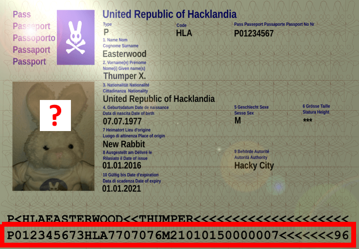

# Your Passport, please

<div class="metadata-table"></div>

<table>
<tr>
<td rowspan="2" width="20%"></td>
<th height="20px"><b>Category</b></th>
<th><b>Keywords</b></th>
<th><b>Tools</b></th>
<th><b>Reference</b></th>
</tr>
<tr>
<td>Programming</td>
<td>EPassport, Doc9303, ISO7816, MRZ, BAC, MRTD</td>
<td>
<code>pybots</code>, <code>pypassport</code>
</td>
<td><a href="https://hackyeaster.hacking-lab.com/hackyeaster/challenge24.html">Hacky Easter 2017</a></td>
</tr>
</table>

*After another exhausting Easter, Thumper decides to travel abroad for recreation. As a real h4x0r, he of course is using his own, homemade e-passport:*


*Write a client which connects to the virtual terminal, and fetch the portrait photo stored on Thumper's passport! The virtual terminal is running on:*

```
hackyeaster.hacking-lab.com:7777
```

*As a starting point for your client, the following eclipse project is provided:*

**File**: [`epassclient.zip`](hacky-easter-2017-24/epassclient.zip)

# Short Solution

```python
from pybots.epassport import EPassport

with EPassport('hackyeaster.hacking-lab.com', 7777) as p:
    p.set_MRZ("P012345673HLA7707076M21010150000007<<<<<<<96").get_photo("hacky-easter-2017-24/egg.jpg")
```

# Solution Explained

## 1. Analysis

First, by opening the provided project archive, one can figure out that the source code is located at `epassclient/src/ch/he17/epassclient/` and structured as follows:
- `JMRTDMain.java`: the virtual terminal server application
- `terminal/HE17Card.java`: the card representation (with a hard-coded ATR) based on `smartcardio` package's card definition
- `terminal/HE17Channel.java`: the channel for transmitting and receiving data using APDU classes from `smartcardio` package
- `terminal/HE17Terminal.java`: the virtual terminal that connects to the remote host and manages the presense of the card

As the complete protocol is missing in `JMRTDMain.java`, one needs to find a way to communicate with the remote virtual terminal. For this purpose, it is of common knowledge that epassports follow the [ICAO Doc 9303 standard](https://www.icao.int/publications/pages/publication.aspx?docnum=9303).

According to the Doc9303 specification, the Logical Data Structre (LDS) is defined as follows:


In this structure, one can see that the portrait photo is located at the Data Group 2 (DG2), that is, *Encoded Face*. On this photo, there should be the classical QR Code required to win the challenge.

**Goals**:
1. Implement the protocol required to connect to the virtual terminal
2. Retrieve the content of DG2

**Notes**:
- The ATR (Answer To Reset) can be checked on [Smart Card ATR Parsing](https://smartcard-atr.appspot.com/parse?ATR=3B8880010073C8400000900062) using the bytes found in `epassclient.zip/src/ch/he17/epassclient/terminal/HE17Card.java`.
- Also in the same file, one can see that the defined protocol is `T=1`.

**Acronyms**:
- APDU: Application Protocol Data Unit
- BAC: Basic Access Control
- MRTD: Machine Readable Travel Document
- MRZ: Machine Readable Zone

## 2. Solution

### 2.1 Creating a communication bot

First, let's define a bot for communicating with the remote virtual terminal.


```python
from pybots.netcat import Netcat

with Netcat('hackyeaster.hacking-lab.com', 7777) as nc:
    print(nc.read_until('\n', disp=True))
    # do nothing yet ; just retrieve what the server tells while starting the communication
```

    Passport reader terminal. Card presented... send your apdus as hex-strings terminated by newline


The terminal asks for APDU's, as it was expected because of the protocol required to read the epassport.

### 2.2 Handling the exchange protocol

So, the question is now to figure out which APDU's are required. First, using [the standard (Doc 9303 Specification - Part 10)](hacky-easter-2017-24/ePassport-doc9303_part10_en.pdf), let's inspect the structure of an APDU:

- Command

    ```
     1B   1B   1B  1B  1B   7B   1B
    [CLA][INS][P1][P2][Lc][Data][Le]
    ```
    - `CLA`: instruction class
    - `INS`: instruction type
    - `P1/P2`: additional instruction parameters (e.g. file identifier, file offset)
    - `Lc`: length of input data
    - `Data`: input data
    - `Le`: length of expected output data


- Response

    ```
           2B
    [0x9000|0x6C14]
    ```
    - `0x9000`: everything is OK
    - `0x6C14`: 20 output bytes are ready

There now remains to find how to use the APDU's, that is, the protocol.

For this purpose, one can rely on [this technical guideline](hacky-easter-2017-24/ePassport-doc9303_sec-mechanisms-for-mrtd.pdf) from which the following steps can be deduced:

1. Select Application
2. Perform BAC (based on MRZ)
3. Read DG2

The first step is simple ; it is about sending a *Command APDU* that selects the `eMRTD Application` for reading DG2 afterwards. This is done with the following APDU (see [standard (Doc 9303 Specification - Part 10)](hacky-easter-2017-24/ePassport-doc9303_part10_en.pdf) at pages 8 and 12):
- `CLA  = 00`
- `INS  = A4`
- `P1   = 04`
- `P2   = 0C`
- `Lc   = 07` (computed because of the Application ID `AID`)
- `Data = A0000002471001` (that is, the `AID` of `eMRTD Application`)

Which gives, in term of valid input for the remote virtual terminal:

```
00A4040C07A0000002471001
```

Testing this input gives `9000` as a reponse, which shows that it works as this is the *Response APDU* that tells that everything is OK. This then shows the output format when the remort virtual terminal answers.

In order to simplify working with the standard, let's try to work with a Python library that already implements it. For this purpose, one can find [`pypassport-2.0`](https://github.com/andrew867/epassportviewer/tree/master/pypassport-2.0/), which is part of the [`epassportviewer` project](https://github.com/andrew867/epassportviewer).

### 2.3 Using `pypassport-2.0`

After manual install, one can find help in the `pypassport.epassport` module that provides an interesting example.


```python
import pypassport.epassport
#help(pypassport.epassport)
```

```
     |  >>> from pypassport.epassport import EPassport, mrz
     |  >>> from pypassport.reader import pcscAutoDetect
     |  >>> from pypassport.openssl import OpenSSLException
     |  >>> detect = pcscAutoDetect()
     |  >>> detect
     |  (<pypassport.reader.pcscReader object at 0x00CA46F0>, 1, 'OMNIKEY CardMan 5x21-CL 0', 'GENERIC')
     |  >>> reader = detect[0]
     |  >>> mrz = mrz.MRZ('EHxxxxxx<0BELxxxxxx8Mxxxxxx7<<<<<<<<<<<<<<04')
     |  >>> mrz.checkMRZ()
     |  True
     |  >>> p = EPassport(mrz, reader)
     |  Select Passport Application
     |  >>> p["DG1"]
     |  Reading DG1
```

In order to use this library, one needs to create a reader that handles the challenge-related virtual terminal. This will allow use to read DG2 without caring for implementing the aforementioned steps.

Let's thus emulate it implementing the required methods from the `Reader` template class. The customized reader will simply bind an input bot for dealing with the remote virtual terminal.

```python
from pypassport.apdu import ResponseAPDU
from pypassport.reader import Reader

class RemoteVirtualTerminal(Reader):
    readerNum = 0
    
    def __init__(self, bot):
        self.__bot = bot
    
    def __write(self, apdu):
        self.__bot.write("".join(x.strip(">[]") for x in str(apdu).split()))
        
    def connect(self, readerNum=None):
        pass  # no need to connect as this is handled in the bot
    
    def disconnect(self):
        pass  # no need to disconnect as this is handled in the bot
    
    def getReaderList(self):
        return ["WebTerminal"]
    
    def transmit(self, apdu):
        print("--{}".format(str(apdu)))
        self.__write(apdu)
        response = self.__bot.read_until('\n').rstrip()
        response, code = response[:-4], response[-4:]
        shortened = (response[:37] + '...') if len(response) > 40 else response
        intcode = [int('0x{}'.format(h), 16) for h in re.findall('..', code)]
        print("<-- {} ({})".format("{} [{}]".format(shortened, code).strip(),
                                 ["Error", "OK"][code == "9000"]))
        return ResponseAPDU(response.decode('hex'), *intcode)
```

There now remains to instantiate the reader using the dedicated EPassport bot implemented in the `pybots` library with MRZ's relavant information (that is, the second line, with the *Document Number*, the *Date of Birth* and the *Date of Expiracy*, required for the BAC).



### 2.4 Solving the challenge with `pybots`

```python
from pybots.epassport import EPassport

with EPassport('hackyeaster.hacking-lab.com', 7777, verbose=True) as p:
    p.set_MRZ("P012345673HLA7707076M21010150000007<<<<<<<96").get_photo("hacky-easter-2017-24/egg.jpg")
```

    20:49:29 [DEBUG] Initialization done.
    20:49:29 [DEBUG] Precomputing...
    20:49:29 [DEBUG] Precomputation done.
    20:49:29 [DEBUG] Processing preamble...
    20:49:29 [DEBUG] Preamble done.
    20:49:29 [INFO] Select eMRTD Application
    20:49:29 [DEBUG] --> 00 A4 04 0C 07 [A0000002471001] 
    20:49:30 [DEBUG] <-- [9000]
    20:49:30 [DEBUG] Ingoing APDU format determined as hex string
    20:49:30 [DEBUG] Outgoing APDU format determined as hex string
    20:49:30 [DEBUG] --> 00 A4 04 0C 07 [A0000002471001] 
    20:49:30 [DEBUG] <-- [9000]
    20:49:30 [INFO] Basic Access Control
    20:49:30 [DEBUG] --> 00 84 00 00  [] 08
    20:49:30 [DEBUG] <-- 6C5544797A91115D [9000]
    20:49:30 [DEBUG] --> 00 82 00 00 28 [61EFAA9CD7DC1339180F94C0122289D424650E69CFF61A7DCA77B8AD4E84E463D659B8E3EC71B4B3] 28
    20:49:30 [DEBUG] <-- B54E73D9D815F466A4310CE62496E1BA595EB... [9000]
    20:49:30 [INFO] Get encoded face from DG2
    20:49:30 [DEBUG] --> 0C A4 02 0C 15 [8709014EC2A66E1EC4B6EC8E08C32FB3DF944BA521] 00


    Passport reader terminal. Card presented... send your apdus as hex-strings terminated by newline


    20:49:30 [DEBUG] <-- 990290008E083616DFFCE923C223 [9000]
    20:49:30 [DEBUG] --> 0C B0 00 00 0D [9701048E088B8BABCF9D23EA51] 00
    20:49:30 [DEBUG] <-- 870901D2CDEE703212A0C0990290008E08923... [9000]
    20:49:30 [DEBUG] --> 0C B0 00 04 0D [9701DF8E0830AFA9A3F8309722] 00
    20:49:30 [DEBUG] <-- 8781E1017E3391D06B2A8A52E206B8A62A099... [9000]
    20:49:30 [DEBUG] --> 0C B0 00 E3 0D [9701DF8E0858825BFED96A885A] 00
    20:49:30 [DEBUG] <-- 8781E1018C848EA4E9AC1EF0D449EED0F3C11... [9000]
    20:49:30 [DEBUG] --> 0C B0 01 C2 0D [9701DF8E087146E85BC73B8EE2] 00
    20:49:30 [DEBUG] <-- 8781E101F6AD3B789FDAC76DFB39AA3CF4682... [9000]
    20:49:30 [DEBUG] --> 0C B0 02 A1 0D [9701DF8E08656AB658D6C9D394] 00
    20:49:30 [DEBUG] <-- 8781E101E6C3C3244FDCC520884CB57202109... [9000]
    20:49:30 [DEBUG] --> 0C B0 03 80 0D [9701DF8E08960E1A2DACEFF898] 00
    20:49:30 [DEBUG] <-- 8781E101AB016C62B04CB81A51E3F7C91E5AD... [9000]
    20:49:30 [DEBUG] --> 0C B0 04 5F 0D [9701DF8E087EA8AC0C485CCDCF] 00
    20:49:30 [DEBUG] <-- 8781E1015F26B8E8C9366E138ED98A74E316F... [9000]
    20:49:30 [DEBUG] --> 0C B0 05 3E 0D [9701DF8E0839DA6446819F2F36] 00
    20:49:30 [DEBUG] <-- 8781E1014ACC0293D1920EDDA2BF280D1DA02... [9000]
    20:49:30 [DEBUG] --> 0C B0 06 1D 0D [9701DF8E08AAE2619BD3EB7DA5] 00
    20:49:30 [DEBUG] <-- 8781E1016EB55413807441D875E5FAF6DBB1E... [9000]
    20:49:30 [DEBUG] --> 0C B0 06 FC 0D [9701DF8E081575F8B0D45D8E85] 00
    20:49:30 [DEBUG] <-- 8781E1011FC7345B7881F02D2DA282114C61E... [9000]
    20:49:30 [DEBUG] --> 0C B0 07 DB 0D [9701DF8E0829FC3E8A9DF804BE] 00
    20:49:30 [DEBUG] <-- 8781E10129E42BFEF88895517F483ED374283... [9000]
    20:49:30 [DEBUG] --> 0C B0 08 BA 0D [9701DF8E08990D7A038B6AFA09] 00
    20:49:30 [DEBUG] <-- 8781E101A2EF234E7D6FD4516ECF9BCABFDE7... [9000]
    20:49:30 [DEBUG] --> 0C B0 09 99 0D [9701DF8E0860459B974515C684] 00
    20:49:30 [DEBUG] <-- 8781E10179F8642CB1083FE92F9F73F233A3F... [9000]
    20:49:30 [DEBUG] --> 0C B0 0A 78 0D [9701DF8E0802184AA6992901D9] 00
    20:49:30 [DEBUG] <-- 8781E101A1E221D17ADC07FAF7FE1671F70C8... [9000]
    20:49:30 [DEBUG] --> 0C B0 0B 57 0D [9701DF8E086C4BE49F7A1D3FDB] 00
    20:49:30 [DEBUG] <-- 8781E101C7CBCD85323DA3F8EFE93AD9308A8... [9000]
    20:49:30 [DEBUG] --> 0C B0 0C 36 0D [9701DF8E08250AE3D59ADA66E8] 00
    20:49:30 [DEBUG] <-- 8781E101826A5F4D55D4B1798A94AF890BC4C... [9000]
    20:49:30 [DEBUG] --> 0C B0 0D 15 0D [9701DF8E08E574EF5461D4F95B] 00
    20:49:30 [DEBUG] <-- 8781E1016A6AEB9B9CB68D6544AF6A9D9CFFC... [9000]
    20:49:31 [DEBUG] --> 0C B0 0D F4 0D [9701DF8E08B7040297DFAE8C56] 00
    20:49:31 [DEBUG] <-- 8781E1014C0F32FB11C0BF276AF63B6522C1C... [9000]
    20:49:31 [DEBUG] --> 0C B0 0E D3 0D [9701DF8E0891FBC5DCDAD33244] 00
    20:49:31 [DEBUG] <-- 8781E101CBC7FE7A8E64DD3F96D5540FC3907... [9000]
    20:49:31 [DEBUG] --> 0C B0 0F B2 0D [9701DF8E08D0D5D0D00C3D5213] 00
    20:49:31 [DEBUG] <-- 8781E101CFCBC6F3C8DE4D34C4F097B9E7BEC... [9000]
    20:49:31 [DEBUG] --> 0C B0 10 91 0D [9701DF8E081ED0EC9A6CF3C1B6] 00
    20:49:31 [DEBUG] <-- 8781E1012D5620BFE59DE215B858565CC6BCF... [9000]
    20:49:31 [DEBUG] --> 0C B0 11 70 0D [9701DF8E0812F8867DEB305CF6] 00
    20:49:31 [DEBUG] <-- 8781E101CDC4566863EE114B161B59CBDE8D8... [9000]
    20:49:31 [DEBUG] --> 0C B0 12 4F 0D [9701DF8E08A43D719871AC0A3C] 00
    20:49:31 [DEBUG] <-- 8781E101979C2E84795A0F062E54392978484... [9000]
    20:49:31 [DEBUG] --> 0C B0 13 2E 0D [9701DF8E08AEBD700BD506E296] 00
    20:49:31 [DEBUG] <-- 8781E1010583332AD58C8DEAA6D74D70A71BF... [9000]
    20:49:31 [DEBUG] --> 0C B0 14 0D 0D [9701DF8E084D8825BCEDB95803] 00
    20:49:31 [DEBUG] <-- 8781E101753655E6B12E819ECB1EAAD81687F... [9000]
    20:49:31 [DEBUG] --> 0C B0 14 EC 0D [9701DF8E08357362D9A83399B5] 00
    20:49:31 [DEBUG] <-- 8781E1017EE65F4B7BB94A557C2B426DEBD39... [9000]
    20:49:31 [DEBUG] --> 0C B0 15 CB 0D [9701DF8E08C4092051F65D1B7C] 00
    20:49:31 [DEBUG] <-- 8781E1017AA8C2FC61AF59D434F49A8E5EF69... [9000]
    20:49:31 [DEBUG] --> 0C B0 16 AA 0D [9701DF8E0808712DC02D69D477] 00
    20:49:31 [DEBUG] <-- 8781E10147684710F1053EA0B34A26D21691F... [9000]
    20:49:31 [DEBUG] --> 0C B0 17 89 0D [9701DF8E08DC1E00151482578B] 00
    20:49:31 [DEBUG] <-- 8781E101746521AA81998BDBBBB680384FF04... [9000]
    20:49:31 [DEBUG] --> 0C B0 18 68 0D [9701DF8E0876B06AF74E58CD24] 00
    20:49:31 [DEBUG] <-- 8781E1014A2E679FC4897A6F747D386F6E93F... [9000]
    20:49:31 [DEBUG] --> 0C B0 19 47 0D [9701DF8E08BEF0025E917025D7] 00
    20:49:31 [DEBUG] <-- 8781E10189535CC6315FCD1FE2AA480DE21E2... [9000]
    20:49:31 [DEBUG] --> 0C B0 1A 26 0D [9701DF8E08E4FF1F1365D63C77] 00
    20:49:31 [DEBUG] <-- 8781E101A70CFD532BDC2915EB16953BEB792... [9000]
    20:49:31 [DEBUG] --> 0C B0 1B 05 0D [9701DF8E082737959663B75491] 00
    20:49:31 [DEBUG] <-- 8781E1010E18857F1BD2C367FA7062D5AAD75... [9000]
    20:49:31 [DEBUG] --> 0C B0 1B E4 0D [9701DF8E08C9D1B62C4539EE93] 00
    20:49:31 [DEBUG] <-- 8781E101878C056B736BA3A8BFAE3BA54CA91... [9000]
    20:49:31 [DEBUG] --> 0C B0 1C C3 0D [9701DF8E08DB8144DAFCF66BF5] 00
    20:49:31 [DEBUG] <-- 8781E101FBFD140FD6E302C9122C8F1D4CDA3... [9000]
    20:49:31 [DEBUG] --> 0C B0 1D A2 0D [9701DF8E08F688DBD691ED0E13] 00
    20:49:31 [DEBUG] <-- 8781E1015AF2CD438FBFB3FCB42466C7DA987... [9000]
    20:49:31 [DEBUG] --> 0C B0 1E 81 0D [9701DF8E08B44DD0B2C75F2148] 00
    20:49:31 [DEBUG] <-- 8781E101A9D140CB3FCF2C1BF7E7A47D7BB79... [9000]
    20:49:31 [DEBUG] --> 0C B0 1F 60 0D [9701DF8E08B970C5816408EC03] 00
    20:49:32 [DEBUG] <-- 8781E1016DC5DF3647570E2C7195F3D4B8AD1... [9000]
    20:49:32 [DEBUG] --> 0C B0 20 3F 0D [9701DF8E08EE733530CED3A66B] 00
    20:49:32 [DEBUG] <-- 8781E10164A58FF212A8D7AC8AA538150283C... [9000]
    20:49:32 [DEBUG] --> 0C B0 21 1E 0D [9701DF8E08F7B07F7C7C794722] 00
    20:49:32 [DEBUG] <-- 8781E1015C99FF7F708CC01050908E28C342D... [9000]
    20:49:32 [DEBUG] --> 0C B0 21 FD 0D [9701DF8E0850D947E1BB5ED5D2] 00
    20:49:32 [DEBUG] <-- 8781E101CC5E1844DCA3D7AFD46686A33B50D... [9000]
    20:49:32 [DEBUG] --> 0C B0 22 DC 0D [9701DF8E084159DDD2C52B7A43] 00
    20:49:32 [DEBUG] <-- 8781E10103F10D908BA2524B87B14CFF9BF40... [9000]
    20:49:32 [DEBUG] --> 0C B0 23 BB 0D [9701DF8E0846C117EEB5E701F5] 00
    20:49:32 [DEBUG] <-- 8781E101AC51A00FDFD8168187AF4B49836CA... [9000]
    20:49:32 [DEBUG] --> 0C B0 24 9A 0D [9701DF8E0819DF234EF3A02B54] 00
    20:49:32 [DEBUG] <-- 8781E10156EAD7B805A6D6B6104F4ADD9BA02... [9000]
    20:49:32 [DEBUG] --> 0C B0 25 79 0D [9701DF8E086414A09074CEE4D3] 00
    20:49:32 [DEBUG] <-- 8781E101B076A6AAD6E0826714F5905025651... [9000]
    20:49:32 [DEBUG] --> 0C B0 26 58 0D [9701DF8E08125BBDE0473338BA] 00
    20:49:32 [DEBUG] <-- 8781E101C0E5B1FE1DCE08ECBCAB3AB216AEA... [9000]
    20:49:32 [DEBUG] --> 0C B0 27 37 0D [9701DF8E08E72862D2CD43487B] 00
    20:49:32 [DEBUG] <-- 8781E10126EB39519653A284F6577DC730520... [9000]
    20:49:32 [DEBUG] --> 0C B0 28 16 0D [9701DF8E08AF46B5F61A390B62] 00
    20:49:32 [DEBUG] <-- 8781E101AA2B610EF0998253DC30E3CE609FC... [9000]
    20:49:32 [DEBUG] --> 0C B0 28 F5 0D [9701DF8E0817B152997410EB4A] 00
    20:49:32 [DEBUG] <-- 8781E10182CEAC938E0ED95D2C4B8D32BE2FF... [9000]
    20:49:32 [DEBUG] --> 0C B0 29 D4 0D [9701DF8E08E3806F64FD1A6033] 00
    20:49:32 [DEBUG] <-- 8781E1013C751B660818574BDF87B1368CB93... [9000]
    20:49:32 [DEBUG] --> 0C B0 2A B3 0D [9701DF8E0888634983AA6ECEF7] 00
    20:49:32 [DEBUG] <-- 8781E1010CD61939748E83DB8E2C79D38098E... [9000]
    20:49:32 [DEBUG] --> 0C B0 2B 92 0D [9701DF8E086958DEE7775791A8] 00
    20:49:32 [DEBUG] <-- 8781E1010B3FDDA7596CBC5AB3DE91F6B7E23... [9000]
    20:49:32 [DEBUG] --> 0C B0 2C 71 0D [9701DF8E08692D2993DD12143D] 00
    20:49:32 [DEBUG] <-- 8781E101E3B5C36AEFADD4E1B19AFEB9799F2... [9000]
    20:49:32 [DEBUG] --> 0C B0 2D 50 0D [9701DF8E083DF4BED6610236AE] 00
    20:49:32 [DEBUG] <-- 8781E10123F843902AFE6A837FE03FC66B073... [9000]
    20:49:32 [DEBUG] --> 0C B0 2E 2F 0D [9701DF8E087A7C2B9C7EC99861] 00
    20:49:32 [DEBUG] <-- 8781E1017BA1F48371994CC7AD9A91ABB64B6... [9000]
    20:49:32 [DEBUG] --> 0C B0 2F 0E 0D [9701DF8E08ABEC4B23520EA036] 00
    20:49:32 [DEBUG] <-- 8781E101745279A1C3F735EE6D7AE218C41CA... [9000]
    20:49:32 [DEBUG] --> 0C B0 2F ED 0D [9701DF8E08569542EB4BD3E56A] 00
    20:49:32 [DEBUG] <-- 8781E101D0F17D2E3F7835BAB9F999AED6C84... [9000]
    20:49:32 [DEBUG] --> 0C B0 30 CC 0D [9701688E08F73FED88C49A5CBF] 00
    20:49:32 [DEBUG] <-- 8771012E7234DF8E7C46F46DBA03786BC7DFE... [9000]


**Egg**:  
