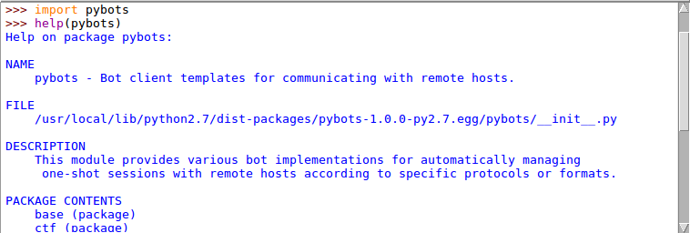

## Overview

Each bot class is implemented as a context manager and has a basically configured logger attached. It can thus be instantiated in a clear and straightforward way. Here is an example:

```
from pybots import Netcat

class MyBot(Netcat):
    def precompute(self):
        self.lookup_table = ...

    def preamble(self):
        self.read_until('>')

with MyBot("remote_host", 1234) as bot:
    bot.write("Hello!")
    data = bot.read_until("hash: ")
    hash = data.split("hash: ")[-1]
    hash = bot.lookup_table[hash]
    bot.write(hash)
```

Note that, if a bot is used behind a proxy, it will use system's proxy settings. This can be bypassed by using `no_proxy=True` while instantiating the bot.

```
with MyBot("LAN_host", 1234, no_proxy=True) as bot:
    # ...
```


## Getting help

Each module is documented. Python's built-in `help` function can thus be used to get help from an interactive console.




## General-purpose bots

### `SocketBot`

This generic bot is mostly inspired from this [Gist](https://gist.github.com/leonjza/f35a7252babdf77c8421). It also handles system's proxy settings using an implementation inspired from this [recipe](http://code.activestate.com/recipes/577643-transparent-http-tunnel-for-        python-sockets-to-be-u/).

It can be instantiated using the following arguments:

**Argument** | **Default** | **Description**
--- | --- | ---
`host` |  | Hostname or IP address
`port` |  | Port number
`disp` | `False` | Display all exchanged messages or not
`verbose` | `False` | Verbose mode or not
`prefix` | `False` | Prefix messages for display or not
`no_proxy` | `False` | Force ignoring system proxy settings

When a SocketBot is instantiated, it only registers the input arguments as attributes and creates an empty buffer for collecting the received data. In order to initiate a communication, the `connect` method must be used. This way, the associated socket can be reconnected or connections to other remote hosts can be made with the same bot.

For communicating, the bot has four methods:

- `write`: for writing to the socket
- `read`: for reading on the socket a given length of bytes
- `read_until`: for reading blocks until a given pattern is reached
- `send_receive`: for combining `write` then `read_until`

Each time a read method is used, the buffer is consumed and the method returns the collected data.

An example of use of the SocketBot class is the Netcat bot (see next section).


## Specific-purpose bots

### `Netcat`
