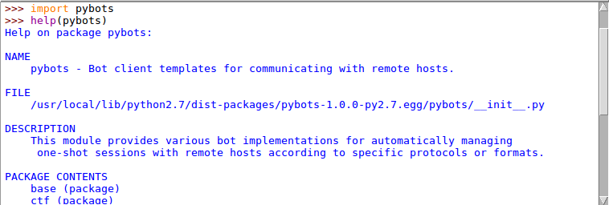
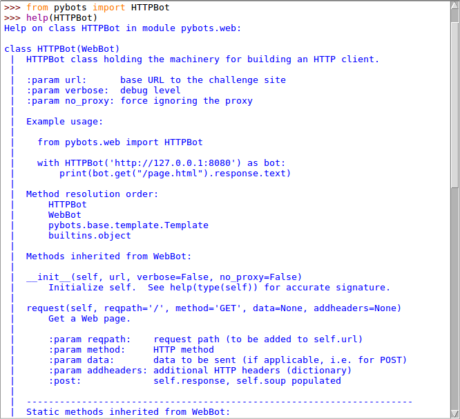

## Overview

Each bot class is implemented as a context manager and has a basic configured logger attached. It can thus be instantiated in a clear and straightforward way. Here is an example:

```python
from pybots import TCPBot

class MyBot(TCPBot):
    def precompute(self):
        self.lookup_table = ...

    def preamble(self):
        self.read_until('>')

with MyBot("remote_host", 1234) as bot:
    bot.write("Hello!")
    data = bot.read_until("hash: ")
    hash = data.split("hash: ")[-1]
    hash = bot.lookup_table[hash]
    bot.write(hash)
```

Note that, if a bot is used behind a proxy, it will use system's proxy settings. This behavior can be bypassed by using `no_proxy=True` while instantiating the bot.

```python
with MyBot("LAN_host", 1234, no_proxy=True) as bot:
    # ...
```

-----

## Getting help

Each module is documented. Python's built-in `help` function can thus be used to get help from an interactive console.





-----

## Features

Each bot comes with the following features (in order of precedence), inherited from the template:

- **Logging**: A public method named `configure` sets the logging level and attaches a logger to the bot. Logging can thus be reconfigured in the context of the bot. The verbose mode is a boolean and configures the bot for debugging if the value is false.

```python hl_lines="2"
""" verbose mode example """
with Bot(..., verbose=True) as bot:
    # debug messages will be displayed
    # if verbose=False, logging is configured to INFO
```

```python hl_lines="3"
""" logging reconfiguration example """
with Bot(...) as bot:
    bot.configure(new_log_message_format, new_date_format)
```

!!! note "Default formats"
    * Messages: `%(asctime)s [%(levelname)s] %(message)s`
    * Dates: `%H:%M:%S`

- **System proxy settings**: When the bot starts, it gets the system proxy settings to work with (`no_proxy=False` by default). This behavior can be overridden by setting `no_proxy=False`.

```python hl_lines="2"
""" no proxy example """
with Bot(..., no_proxy=True) as bot:
    # the bot ignores the proxy settings
```

- **Pre/Post-computation**: By default, when a bot is initialized, it tries to execute a public method named `precompute` if it exists. This allows to perform computations BEFORE the context of the bot is entered. Similarly, when a bot comes to the end of its execution, it tries to execute a public method named `postcompute` if it exists. This allows to perform computations AFTER bot's communication has ended, just before exiting the context.

```python hl_lines="3 4 6 7 8"
""" precomputation example """
class MyBot(Bot):
    def postcompute(self):
        # perform some computation

    def precompute(self):
        # perform some computation
        # create attributes for use in bot's context

with MyBot(...) as bot:
    # use bot's precomputed attributes
    # let the bot postcompute other stuffs
```

!!! note "Default behavior"
    Fail-open (the bot continues if the pre/post-computation fails and provides a warning)

- **Pre/Post-amble**: By default, when bot's context is entered, it tries to execute a public method named `preamble` if it exists. This allows to play a preamble with the remote host to keep bot's context code clean. Similarly, when a bot comes to the end of its context, it tries to execute a public method named `postamble` if it exists. This allows to perform actions before bot's communication has ended, thus before exiting the context.

```python hl_lines="3 4 6 7"
""" preamble example """
class MyBot(Bot):
    def postamble(self):
        # play some postamble commands

    def preamble(self):
        # play some preamble commands

with MyBot(...) as bot:
    # start using the bot without caring for the pre/post-amble actions
```

!!! note "Default behavior"
    Fail-close (the bot crashes if the preamble fails and displays the exception with its traceback)

